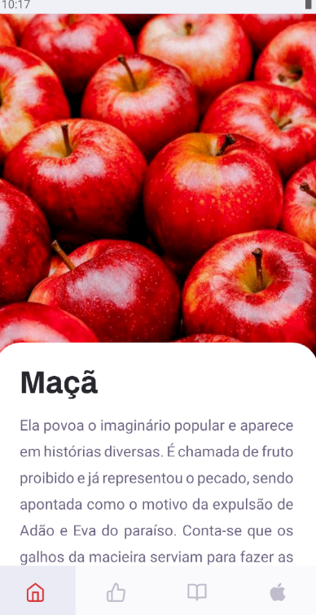
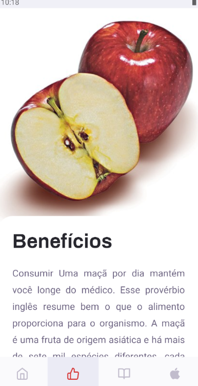

<div style="display: flex; flex-direction: 'row'; justify-content:'center';">
<h3 align="center">
   
   
</h3>
</div>
   
<p align="center"> 🚀 Frui Project: An application about apples.
 </p>
 
# :pushpin: Table of Contents

- [Technologies](#tecnologias-utilizadas)
- [How to run](#como-usar)

## :rocket: Technologies

The project was developed using the following technologies

- [React Native](https://reactnative.dev/)
## :fire: How to run

### :exclamation: Fake backend API
To start use the commands after clone this repository:
```
yarn 
yarn run:android // yarn run:ios
```

<h4 align="center">
    Made with 💜 by <a href="https://www.linkedin.com/in/guilherme-orcezi" target="_blank">Guilherme Orcezi</a>
</h4>
